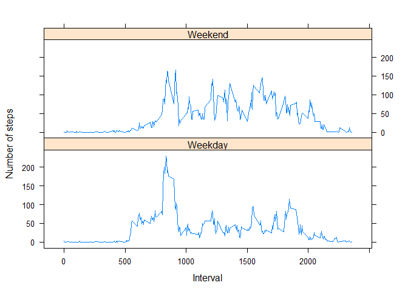

```r
knitr::opts_chunk$set(echo = TRUE)
```

# Analysing Activity


```r
setwd("~/Cursos/R_specialization/data/c5_w2")
```

## Loading and/or preprocessing the data


```r
 if (!file.exists('repdata_data_activity/activity.csv')) {

        unzip('.repdata_data_activity/activity.zip', exdir = '.');
    }

activity <- read.csv("repdata_data_activity/activity.csv")
```

## What is mean total number of steps taken per day?
#### For this part of the assignment, you can ignore the missing values in the dataset.

### 1.Calculate the total number of steps taken per day


```r
steps_day <- aggregate(steps ~ date, data = activity, sum, na.rm = TRUE)
```

### 2.Make a histogram of the total number of steps taken each day

Calculate and report the mean and median total number of steps taken per day

```r
hist(steps_day$steps, main = 'Number Of Steps per Day', xlab = 'Steps')
```

<!-- -->


### 3.Calculate and report the mean and median total number of steps taken per day


```r
steps_mean   <- mean(steps_day$steps)
steps_median <- median(steps_day$steps)

steps_mean
```

```
## [1] 10766.19
```

```r
steps_median
```

```
## [1] 10765
```

```r
cat('The mean of the steps per day was' ,steps_mean, 'and the median was',steps_median)
```

```
## The mean of the steps per day was 10766.19 and the median was 10765
```

## What is the average daily activity pattern?

### 1.Make a time series plot (i.e. type = "l") of the 5-minute interval (x-axis) and the average number of steps taken, averaged across all days (y-axis)


```r
# October and November, 2012 - number of steps taken in 5 minute intervals each day.


steps_interval <- aggregate(steps ~ interval, data = activity, mean, na.rm = TRUE)


plot(steps_interval$interval,
         steps_interval$steps,
         main = 'Time Series Plot',
         xlab = '5 Minute Interval',
         ylab = 'Average Number Of Steps',
         type = 'l'
    )
```

<!-- -->

### 2.Which 5-minute interval, on average across all the days in the dataset, contains the maximum number of steps?


```r
max_steps    <- max(steps_interval$steps)
max_interval <- steps_interval[steps_interval$steps == max_steps, 1]

max_steps 
```

```
## [1] 206.1698
```

```r
max_interval
```

```
## [1] 835
```

```r
cat('In the interval ' ,max_interval, ', the max number of steps took place, on average: ',max_steps)
```

```
## In the interval  835 , the max number of steps took place, on average:  206.1698
```

## Imputing missing values

### 1.Calculate and report the total number of missing values in the dataset (i.e. the total number of rows with NAs)


```r
nbr_NAs <- sum(is.na(activity$steps))


cat("The number of missing values is " ,nbr_NAs)
```

```
## The number of missing values is  2304
```


### 2.Devise a strategy for filling in all of the missing values in the dataset. The strategy does not need to be sophisticated. For example, you could use the mean/median for that day, or the mean for that 5-minute interval, etc.

## The strategy is to use the mean of the  5-minute interval, rounded to get an integer:


```r
steps_interval <- aggregate(steps ~ interval, data = activity, mean, na.rm = TRUE)

fillNA <- numeric()

for (i in 1:nrow(activity)) {
    activity_row <- activity[i, ]
    if (is.na(activity_row$steps)) {
        steps <- subset(steps_interval, interval == activity_row$interval)$steps
    } else {
        steps <- activity_row$steps
    }
    fillNA <- c(fillNA, round(steps))
}
```

### 3.Create a new dataset that is equal to the original dataset but with the missing data filled in.


```r
activ_without_NAs<-activity

activ_without_NAs$steps<- fillNA
```

### 4.Make a histogram of the total number of steps taken each day and Calculate and report the mean and median total number of steps taken per day. 

#### Do these values differ from the estimates from the first part of the assignment? 
#### What is the impact of imputing missing data on the estimates of the total daily number of steps?


```r
steps_day_withoutNAs <- aggregate(steps ~ date, data = activ_without_NAs, sum, na.rm = TRUE)

hist(steps_day_withoutNAs$steps, main = 'Number Of Steps per Day (without NAs)', xlab = 'Steps')
```

<!-- -->


```r
steps_mean_withoutNAs   <-   mean(steps_day_withoutNAs$steps)
steps_median_withoutNAs <- median(steps_day_withoutNAs$steps)

steps_mean_withoutNAs
```

```
## [1] 10765.64
```

```r
steps_median_withoutNAs
```

```
## [1] 10762
```

```r
cat('The mean of the steps per day (without NAs) was' ,steps_mean_withoutNAs, 'and the median was',steps_median_withoutNAs)
```

```
## The mean of the steps per day (without NAs) was 10765.64 and the median was 10762
```

```r
print('')
```

```
## [1] ""
```

```r
cat('The mean of the steps per day (WITH NAs) was' ,steps_mean, 'and the median was',steps_median)
```

```
## The mean of the steps per day (WITH NAs) was 10766.19 and the median was 10765
```

```r
print('')
```

```
## [1] ""
```

```r
cat('So, there are differences but quite small')
```

```
## So, there are differences but quite small
```

## Are there differences in activity patterns between weekdays and weekends?
#### For this part the weekdays() function may be of some help here. Use the dataset with the filled-in missing values for this part.

### 1.Create a new factor variable in the dataset with two levels – “weekday” and “weekend” indicating whether a given date is a weekday or weekend day.


```r
activ_without_NAs$type_day <-ifelse(weekdays(as.Date(activ_without_NAs$date)) %in% c('saturday','sunday','sábado','domingo'), 'Weekend', 'Weekday')


activ_without_NAs$type_day <- factor(activ_without_NAs$type_day)
```
### 2.Make a panel plot containing a time series plot (i.e. type = "l") of the 5-minute interval (x-axis) and the average number of steps taken, averaged across all weekday days or weekend days (y-axis). See the README file in the GitHub repository to see an example of what this plot should look like using simulated data.


```r
library(lattice)

activ_type <- activ_without_NAs

steps_type_day <- aggregate(steps ~ interval + type_day, data = activ_type, mean, na.rm = TRUE)


xyplot(steps ~ interval | type_day, steps_type_day, type = "l", layout = c(1, 2), 
   xlab = "Interval", ylab = "Number of steps")
```

<!-- -->
